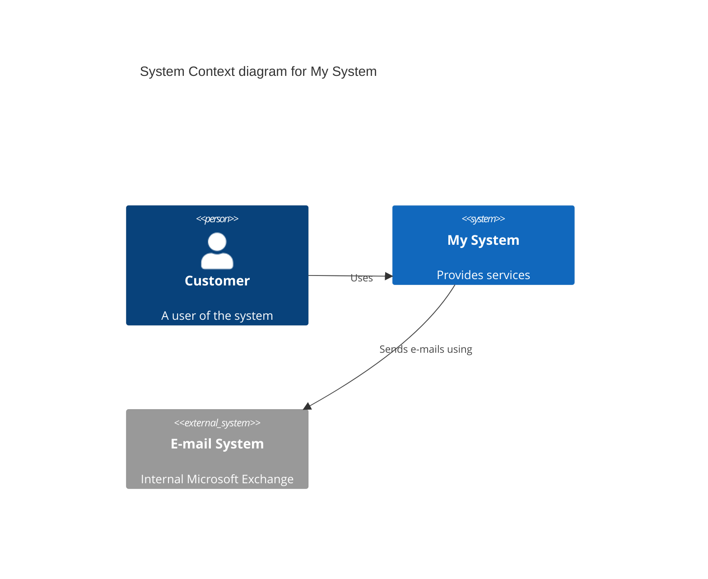
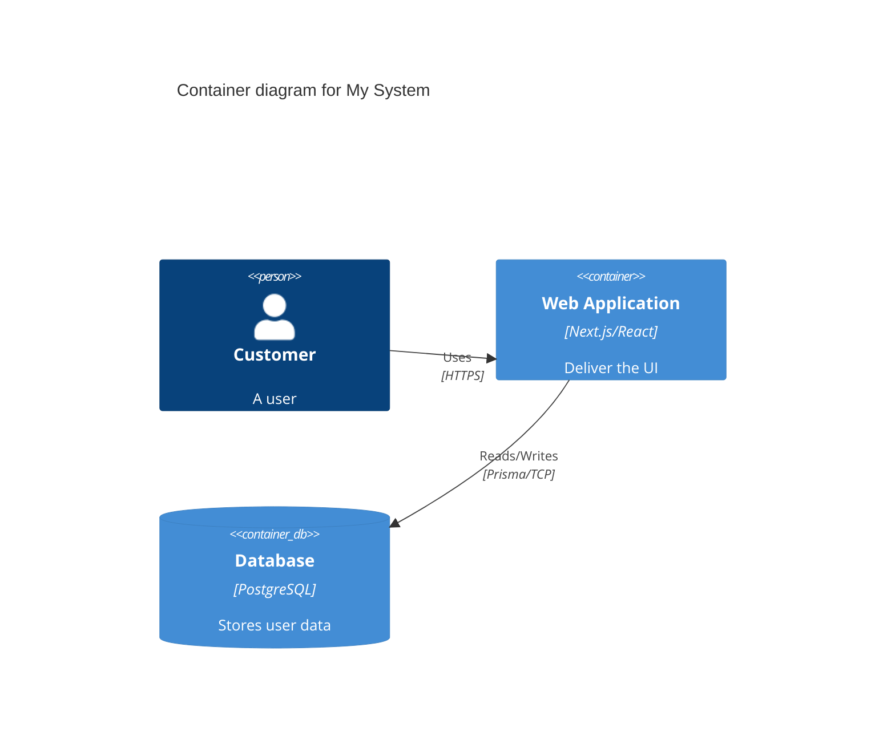

# Skill: C4 Architecture Diagramming
Description: Professional architectural mapping using the C4 Model (Context, Container, Component, Code) with Mermaid syntax.

## 🏗️ The C4 Model
Use this skill to document the system at different levels of abstraction.

### Level 1: System Context
- **Focus:** High-level interactions.
- **Audience:** Everyone.
- **Usage:** Define the system and its users + external system dependencies.

### Level 2: Container Diagram
- **Focus:** The tech stack building blocks (e.g., Next.js App, Postgres DB, Python API).
- **Audience:** Developers and Architects.

### Level 3: Component Diagram
- **Focus:** Logical grouping within a container (e.g., Auth Module, Payment Service).

## 🧜‍♂️ Mermaid Templates

### C4 Context Example

### C4 Container Example

## 📏 Best Practices
1. **Clarity over Complexity:** Only show what is necessary for the current level.
2. **Standard Terminology:** Use "Container" for major apps/DBs and "Component" for modules.
3. **Always Label Relationships:** Do not just draw lines; explain the protocol/reason (e.g., "Uses HTTPS").
