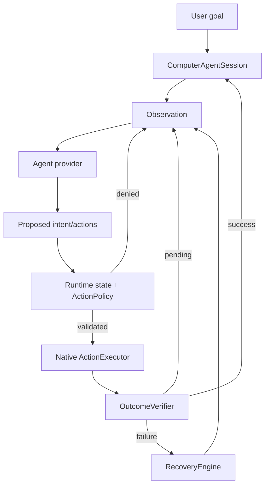

# Akıllı Asistan

A macOS-first autonomous computer-use runtime focused on reliable observation, guarded physical interaction, semantic verification, recovery, and stateful agent execution.

The repository currently contains two macOS codebases:

- **ExamPilot**: the active computer-use runtime and CLI, built as a Swift Package.
- **ZeroLose**: the existing macOS application surface retained in the repository while the reusable runtime evolves.

## Why this project exists

LLM-driven desktop automation fails when model intent is treated as truth. Akıllı Asistan uses a stricter runtime model: the model proposes, deterministic code decides what is legal, native input performs the action, and post-action evidence determines whether the action actually succeeded.

That separation prevents common failure modes such as stale-coordinate replay, repeated blind clicks, acting on loading frames, carrying state from one question/page into the next, and treating any pixel change as proof of success.

## Core capabilities

- ScreenCaptureKit observation of the active Chrome window.
- CoreGraphics mouse, keyboard, scroll, and bounded wait execution.
- Chrome process/window focus continuity checks before live input.
- Runtime-owned lifecycle state with monotonic state versions.
- Hard policy gates for protected navigation and stale proposals.
- UI stability detection before reasoning on a new state.
- Semantic outcome verification for answer mutation, viewport change, and navigation.
- Classified recovery with bounded retries and anti-loop intent fingerprints.
- Session-owned, privacy-bounded working memory and structured telemetry.
- OpenAI Responses structured-vision provider.
- Native OpenAI Computer Use provider contract with `previous_response_id` continuation and `computer_call_output` screenshots.
- Emergency stop, dry-run, and bounded verbose diagnostics modes.

## Architecture



### Authority boundaries

| Component | Responsibility |
| --- | --- |
| Agent provider | Proposes the next action or intent |
| Runtime state | Describes accepted application/task state |
| ActionPolicy | Determines whether a proposed action is executable |
| ActionExecutor | Performs native physical input |
| OutcomeVerifier | Establishes whether the expected effect occurred |
| RecoveryEngine | Changes strategy after classified failures |
| ComputerAgentSession | Owns runtime state, provider continuation, working memory, and stop state |

The provider never directly grants itself permission to navigate, mark an answer as verified, or bypass stale-state checks.

## Requirements

- macOS 14+
- Swift 5.10+
- Google Chrome for the current ExamPilot workflow
- Screen Recording permission
- Accessibility permission for live physical input
- `OPENAI_API_KEY`

## Quick start

```bash
cd ExamPilot
swift test
swift build -c release
```

Run one observation/planning cycle without physical input:

```bash
export OPENAI_API_KEY='<your-key>'
swift run exampilot --dry-run
```

Run live:

```bash
swift run exampilot
```

Optional overrides:

```bash
swift run exampilot --model gpt-5.6-sol
swift run exampilot --max-cycles 80
swift run exampilot --verbose
```

`--verbose` prints bounded cycle-level diagnostics such as state version, question generation, event kind, verification failure ID, and recovery strategy. It deliberately excludes session identifiers, screenshots, provider payloads, raw typed answers, and secrets.

For a reproducible diagnostic run:

```bash
swift run exampilot --verbose --max-cycles 30 2>&1 | tee ~/Desktop/exampilot.log
```

A classified non-progress stop is reported with its stable failure identifier even without verbose mode, for example:

```text
ExamPilot stopped after 13 cycles. reason=repeated_intent_loop. Run with --verbose for cycle-level diagnostics.
```

Press **Ctrl-C** to request an emergency stop.

## Runtime invariants

The active ExamPilot path is intentionally fail-closed:

1. A proposal is bound to the observation state version that produced it.
2. Physical input is rejected if the focused Chrome target no longer matches the captured target.
3. Protected navigation is rejected until the runtime has verified the current answer state.
4. Structural transitions must settle before the next provider turn is accepted.
5. A visual difference alone is not sufficient evidence of semantic success.
6. Repeated failed intents consume a bounded recovery budget; the runtime does not blindly replay the same click.
7. Unknown native Computer Use action types fail closed.
8. Secrets, raw screenshots, typed private text, and provider payloads are not persisted in working-memory telemetry.

## Provider model

Two provider surfaces coexist deliberately:

### Structured vision execution

`OpenAIResponsesVisionAgent` is the current physical-execution planner. It returns the repository's structured action schema, which allows the runtime to classify protected boundaries before any native input occurs.

### Native OpenAI Computer Use

`OpenAIComputerUseProvider` implements the Responses Computer Use contract, including:

- built-in `computer` tool requests;
- ordered `computer_call.actions[]` decoding;
- `previous_response_id` continuation;
- `computer_call_output` screenshots;
- screenshot detail set to `original`;
- fail-closed handling of unknown action types.

Native Computer Use is currently a provider/proposal surface rather than an unrestricted direct physical-execution bypass. It will only become a default executor path when semantic target classification can preserve the same runtime invariants.

## Repository layout

```text
.
├── ExamPilot/                 # Active Swift Package computer-use runtime
│   ├── Package.swift
│   ├── Sources/
│   └── Tests/
├── ZeroLose/                  # Existing macOS application
├── docs/
│   └── superpowers/
│       ├── specs/             # Approved architecture specifications
│       └── plans/             # Incremental implementation plans
├── scripts/
│   └── verify_all.py          # Repository verification gate
├── .github/workflows/
│   └── exampilot.yml          # macOS CI gate
├── AGENTS.md                  # Repository engineering contract
├── CONTRIBUTING.md
├── SECURITY.md
└── LICENSE
```

Legacy provider-adapter directories such as `.agent`, `.codex`, `.claude`, and `.opencode` are intentionally not part of the repository contract.

## Verification

Run the repository gate from the root:

```bash
python3 scripts/verify_all.py
```

The gate checks the cleaned repository layout, runs the ExamPilot test suite, builds ExamPilot in release mode, verifies that the release CLI exposes `--verbose`, and builds ZeroLose with code signing disabled when Xcode is available.

## Development rules

- Add regression coverage for every behavior change that can reach physical input.
- Keep model/provider output untrusted until deterministic policy validates it.
- Preserve strict typing, bounded retries, cancellation, and resource cleanup.
- Do not hardcode API keys, tokens, credentials, or private data.
- Use current official provider documentation before changing OpenAI request/tool contracts.
- Keep architecture decisions and implementation plans under `docs/superpowers/`.

See [AGENTS.md](AGENTS.md) for the repository engineering contract.

## Safety and scope

This project is intended for user-authorized computer interaction and testing. It does not include anti-proctoring, stealth/evasion, CAPTCHA bypass, monitoring defeat, or mechanisms designed to circumvent access controls.

High-impact or irreversible workflows should remain behind explicit approval and application-specific policy gates.

## License

See [LICENSE](LICENSE).
