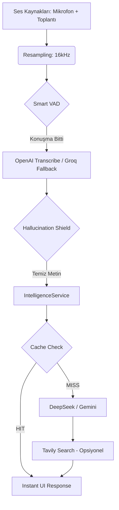

# ZeroLose - Senior AI Interview Assistant (Ghost Mode) 👻

**Version:** 1.4.5  
**Platform:** macOS (Apple Silicon Optimized)  
**Tone:** Stealth, Professional, Senior Engineer Assistant

> ZeroLose, teknik mülakatlar için tasarlanmış, ekran paylaşımı sırasında tamamen görünmez ("Ghost Mode") çalışan, ses ve ekran analizi yapabilen gelişmiş bir yapay zeka asistanıdır.

---

## 🚀 Öne Çıkan Özellikler

### 🛡️ Stealth & Privacy (Gizlilik)
- **Ghost Mode**: Ekran paylaşımı (Zoom, Meet, Teams) sırasında pencere tamamen görünmezdir (`.sharingType = .none`).
- **Global Hotkey (`Cmd+B`)**: Uygulamayı anında gizler veya gösterir.
- **Dock-Less**: Uygulama Dock'ta görünmez, sadece üst menü çubuğundan veya kısayolla yönetilir.
- **Secure Action Policy**: Model çıktılarında `shell` action yürütülmez; yalnızca güvenli AppleScript/stop aksiyonları kabul edilir.

### 🎤 Gelişmiş Ses Mimarisi (Audio Engine v2)
- **No-Echo System Capture**: `ScreenCaptureKit` kullanarak toplantı sesini (karşı taraf) yankı yapmadan dijital olarak yakalar.
- **Microphone Aggregation**: Kendi sesini ve karşı tarafın sesini tek bir kanal üzerinden dinler.
- **Real-time Resampling**: Farklı cihazlardan (AirPods 24kHz, Sistem 48kHz) gelen sesleri anlık olarak 16kHz'e normalize eder; bu sayede transkripsiyon hatası sıfıra iner.
- **Smart VAD (Voice Activity Detection)**: Sessizlik sürelerini akıllıca analiz eder, konuşma bittiği an transkripsiyona başlar.

### 🛡️ Hallucination Shield (Halüsinasyon Kalkanı)
- **Language Filtering**: Sessiz anlarda Whisper'ın uydurduğu Rusça, Çince veya anlamsız URL'leri (`studentinvest.com` vb.) otomatik olarak ayıklar.
- **Nonsense Rejection**: Alakasız alfabe veya karakter içeren çıktıları kullanıcıya göstermeden çöpe atar.

### 🧠 Intelligence & Search
- **Multi-Model Support**: OpenAI-first live interview stack (`gpt-5-mini`, `gpt-5.2-codex`, `gpt-4o-mini`, `gpt-4o-mini-transcribe`) with legacy Ollama Cloud / Groq fallback.
- **Web-Enhanced Reasoning**: Tavily Search ile en güncel kütüphane dokümantasyonlarına anında erişim.
- **Screen Awareness**: Ekranda kod veya diyagram varsa, tek tuşla analiz edip çözüm üretir.
- **Finnish "Puheenkieli" Support**: Günlük dildeki (mä, sä, oot...) konuşmaları mükemmel anlar, profesyonel cevap verir.

---

## 🏗️ Teknik Mimari

### Teknoloji Yığını
- **Core**: SwiftUI (macOS Native).
- **Audio**: ScreenCaptureKit, AVFoundation.
- **Transcription**: OpenAI `gpt-4o-mini-transcribe` tercih edilir; Groq Whisper fallback olarak desteklenir.
- **Intelligence**: IntelligenceService (Unified Orchestrator).
- **Caching**: SHA256 Response Caching (0.2sn cevap süresi).

### Akış Diyagramı

---

## 📦 Kurulum ve Çalıştırma

### Gereksinimler
- **macOS 14.0+**
- **Ekran Kaydı İzni**: Dijital ses yakalama (SCStream) için zorunludur.

### İlk Kurulum
1. DMG içindeki `ZeroLose.app` dosyasını `Applications` klasörüne sürükleyin.
2. Uygulamayı açın ve **Settings (⚙️)** panelinden API key'lerinizi girin:
   - `OpenAI API Key` (önerilen ana LLM + transcription sağlayıcısı).
   - `Ollama Cloud API Key` (opsiyonel legacy fallback).
   - `Groq API Key` (opsiyonel speech-to-text fallback).
   - `Tavily API Key` (İnternet araması için).
3. **Ghost Mode**'u aktif ederek mülakata başlayın.

---

## 🎮 Kullanım Rehberi

### Kısayollar
- **`Cmd+B`**: Uygulama penceresini göster/gizle.
- **`Cmd+L`**: Konsol loglarını temizle.

Not: `Cmd+B` başka bir global shortcut aracı tarafından tutuluyorsa ZeroLose kısayolu kaydedemez. Bu durumda Settings içinde "Retry Cmd+B Registration" ile yeniden deneyin.

### Önemli Modlar
- **Warm-up Modu**: Mülakat öncesi beklenen soruları "Tech Prep Vault" üzerinden önbelleğe alarak 0.2 saniyede cevap üretir.
- **Persona Injection**: CV'nizi veya özel bağlamınızı (Persona) ayarlara ekleyin; AI sizin tecrübelerinize göre ("I have used Rust for...") konuşur.

---

## 🔐 İzinler (Permissions)
Uygulamanın düzgün çalışması için şu izinlerin verilmiş olması kritiktir:
1. **Mikrofon**: Sizin sesiniz için.
2. **Ekran Kaydı (Screen Recording)**: Karşı tarafın sesini yankısız yakalamak ve ekran analizi için.

## 💾 Veri Saklama (Açık Beyan)
- ZeroLose, performans ve bağlam için bazı verileri **kalıcı olarak lokal diske** yazar.
- Varsayılan yer: `~/Library/Application Support/ZeroLose/`
  - `ResponseCache.json` -> Warm-up / cevap cache
  - `interview_vault.json` -> Interview Vault içerikleri
  - `vectors.db` -> RAG embedding + sohbet/pdfs chunk metadata
  - `Captures/*.jpg` -> Uygulama içi ekran yakalama görselleri
- Ayrıca aşağıdaki metinsel bağlamlar `UserDefaults` içinde saklanır:
  - `userPersonaContext` -> Persona & Context
  - `activeJobDescription` -> Active Interview Role / job description
  - `teleprompterText` -> Interview Notes editörü içeriği
- API anahtarları dosyaya değil **Keychain**'e yazılır (`openai_api_key`, `ollama_api_key`, `groq_api_key`, `tavily_api_key`).
- Kaynak kod içinde gömülü/varsayılan canlı API anahtarı yoktur.

### 🌐 Dış Servislere Gönderilen Veri
- `OpenAI`: canlı chat fallback, teknik reasoning/coding, transcription ve (kullanıma bağlı) görsel içerik.
- `Groq`: transcription fallback.
- `Ollama Cloud` ve/veya `Ollama local`: legacy chat fallback ve lokal embedding akışı.
- `Tavily`: web arama sorgusu.
- Bu veriler ilgili sağlayıcıların kendi gizlilik/politikalarına tabidir.

### 🧹 Veri Temizleme
- Ayarlar ekranı:
  - `Clear All Memory` -> `vectors.db` içindeki memory/embedding verisini temizler.
  - `Clear Saved Keys` -> Keychain'deki API anahtarlarını siler.
  - `Clear Persona` -> saklanan persona/context metnini siler.
  - `Clear Role` -> aktif job description metnini siler.
  - `Clear Interview Notes` -> Teleprompter / interview notes içeriğini siler.
- Tam lokal temizlik için:
  - uygulama kapalıyken `~/Library/Application Support/ZeroLose/` klasörünü silin
  - ardından uygulama açıkken yukarıdaki `Clear Persona`, `Clear Role`, `Clear Interview Notes`, `Clear Saved Keys` aksiyonlarını kullanın

## ✅ Test Komutları
- Varsayılan CI/yerel test akışı (unit tests):  
  `xcodebuild -project ZeroLose/ZeroLose.xcodeproj -scheme ZeroLose -destination 'platform=macOS' test`
- UI testleri ayrı scheme ile çalıştırılır:  
  `xcodebuild -project ZeroLose/ZeroLose.xcodeproj -scheme ZeroLose-UI -destination 'platform=macOS' test`
  Not: Bazı makinelerde Gatekeeper, `ZeroLoseUITests-Runner` yürütmesini engelleyebilir (`OS_REASON_EXEC | Gatekeeper policy blocked execution`). Bu durumda UI testlerini Xcode içinden bir kez çalıştırıp sistem güven/trust akışını onayladıktan sonra tekrar deneyin.

---

## 👨‍💻 Geliştirici Bilgisi
**Author:** Dogan  
**Objective:** ZeroLose an interview.  
**Philosophy:** Premium UI, Stealth Logic, Senior Architecture.

*"Mülakatı kaybetmek seçenek değil."* 🚀
