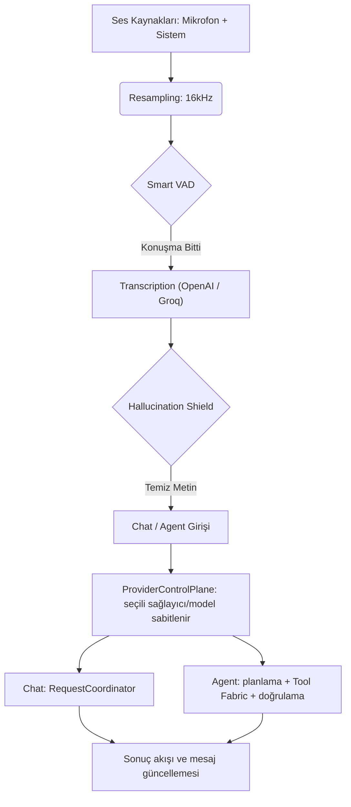

# ZeroLose - Ghost Mode Desktop Assistant 👻

**Version:** 1.4.5  
**Platform:** macOS (Apple Silicon Optimized)  
**Tone:** Stealth, Professional, Senior Engineer Assistant

> ZeroLose, ekran paylaşımı sırasında tamamen görünmez ("Ghost Mode") çalışan, sohbet ve
> otonom görev modlarıyla çalışan genel amaçlı bir macOS masaüstü asistanıdır.

---

## 🚀 Öne Çıkan Özellikler

### 🛡️ Stealth & Privacy (Gizlilik)
- **Ghost Mode**: Ekran paylaşımı (Zoom, Meet, Teams) sırasında pencere tamamen görünmezdir (`.sharingType = .none`).
- **Global Hotkey (`Cmd+B`)**: Uygulamayı anında gizler veya gösterir.
- **Dock-Less**: Uygulama Dock'ta görünmez, sadece üst menü çubuğundan veya kısayolla yönetilir.

### 💬 Chat ve 🤖 Agent Modları
- **Chat Modu**: Tek turlu soru/cevap, dosya eki ve ekran analizi; yanıt akışı seçili model
  sağlayıcısı üzerinden yürütülür ve kullanıcı isteği anında durdurulabilir (Stop).
- **Agent Modu**: Doğal dilde hedef verilir; planlama, araç yürütme, onay/izin kontrolü,
  checkpoint/replay ve bağımsız doğrulama katmanları üzerinden görev yürütülür.
- **Provider Control Plane**: Sohbet ve Agent bir istek başladığı anda kullanılan
  sağlayıcı/model sabitlenir (`ProviderSelectionSnapshot`); arayüzde sağlayıcı değiştirmek
  yalnızca sonraki istekleri etkiler. Sessiz sağlayıcı fallback yoktur.
- **Şeffaf Durum**: Sağlayıcı listesi, kullanılabilirlik durumu ve modeller gerçek
  adaptör durumundan okunur; uydurma model kataloğu üretilmez.
- **Emergency Stop**: Aktif oturumdan bağımsız olarak her modda erişilebilir kalır.

### 🎛️ Sağlayıcılar ve Modeller
- Kayıtlı V2 sağlayıcıları: **Codex**, **Claude**, **OpenCode**, **Antigravity** CLI'ları ve
  **OpenAI API**.
- Model listesi sağlayıcının kendi keşif çıktısından gelir; keşif başarısız olursa durum
  açıkça "failed" olarak gösterilir.
- Agent modu, seçili sağlayıcının yapılandırılmış (JSON) çıktı yeteneği yoksa başlatılmaz.
- OpenAI API anahtarı **Keychain**'de tutulur ve arayüzde yalnızca "tanımlı / tanımlı değil"
  bilgisi gösterilir; anahtar değeri hiçbir zaman gösterilmez.

### 🎤 Gelişmiş Ses Mimarisi (Audio Engine v2)
- **No-Echo System Capture**: `ScreenCaptureKit` kullanarak sistem sesini (karşı taraf) yankı yapmadan dijital olarak yakalar.
- **Microphone Aggregation**: Kendi sesinizi ve sistem sesini tek bir kanal üzerinden dinler.
- **Real-time Resampling**: Farklı cihazlardan (AirPods 24kHz, Sistem 48kHz) gelen sesleri anlık olarak 16kHz'e normalize eder.
- **Smart VAD (Voice Activity Detection)**: Sessizlik sürelerini analiz eder, konuşma bittiği an transkripsiyona başlar.
- **Transkripsiyon**: OpenAI `gpt-4o-mini-transcribe` tercih edilir; Groq Whisper fallback olarak desteklenir.

### 🛡️ Hallucination Shield (Halüsinasyon Kalkanı)
- **Language Filtering**: Sessiz anlarda Whisper'ın uydurduğu anlamsız alfabe/URL çıktılarını otomatik olarak ayıklar.
- **Nonsense Rejection**: Alakasız karakter içeren çıktıları kullanıcıya göstermeden çöpe atar.

### 🧠 Intelligence & Search
- **Web-Enhanced Reasoning**: Tavily Search ile güncel dokümantasyona erişim.
- **Screen Awareness**: Ekranda kod veya diyagram varsa tek tuşla analiz edip çözüm üretir.
- **Approval & Authority**: Araç yürütme politikası `ActionPolicy` ve onay katmanı ile
  sınırlandırılır; model çıktısı yürütme yetkisi değildir.
- **Memory**: Sohbet ve görev bağlamı sınırlı bir çalışma belleğinde tutulur; ham ekran
  görüntüsü, API başlıkları veya gizli değerler belleğe/telemetriye yazılmaz.

---

## 🏗️ Teknik Mimari

### Teknoloji Yığını
- **Core**: SwiftUI (macOS Native).
- **V2 Runtime**: `ProviderControlPlane`, `ModelProviderFabric`, `RequestCoordinator`,
  `AgentCommandRuntime` / `AgentOrchestrator`, Tool Fabric + Policy Kernel,
  checkpoint/replay ve üretim doğrulama katmanları.
- **Audio**: ScreenCaptureKit, AVFoundation.
- **Persistence**: SQLite (runtime event/checkpoint, konuşma, bellek) + UserDefaults
  (gizli olmayan V2 tercihleri) + Keychain (API anahtarları).

### Akış Diyagramı

---

## 📦 Kurulum ve Çalıştırma

### Gereksinimler
- **macOS 26.0+**
- **Ekran Kaydı İzni**: Dijital ses yakalama (SCStream) ve ekran analizi için zorunludur.

### İlk Kurulum
1. DMG içindeki `ZeroLose.app` dosyasını `Applications` klasörüne sürükleyin.
2. Uygulamayı açın ve **Settings (⚙️)** panelinden sağlayıcıları yapılandırın:
   - CLI sağlayıcıları (Codex / Claude / OpenCode / Antigravity) için ilgili CLI'ların
     kurulu ve oturum açmış olması gerekir.
   - `OpenAI API Key` (OpenAI API sağlayıcısı için).
   - `Groq API Key` (konuşma transkripsiyonu için, opsiyonel).
   - `Tavily API Key` (web araması için, opsiyonel).
3. Üst çubuktaki sağlayıcı/model seçiciden çalışmak istediğiniz modeli seçin ve **Chat**
   veya **Agent** modunda kullanmaya başlayın.

---

## 🎮 Kullanım Rehberi

### Kısayollar
- **`Cmd+B`**: Uygulama penceresini göster/gizle.
- **`Cmd+L`**: Konsol loglarını temizle.

Not: `Cmd+B` başka bir global shortcut aracı tarafından tutuluyorsa ZeroLose kısayolu kaydedemez. Bu durumda Settings içinde "Retry Cmd+B Registration" ile yeniden deneyin.

### Önemli Modlar
- **Chat**: Metin, dosya eki veya ekran görüntüsü ile soru sorun; yanıt akarken Stop ile
  isteği durdurun.
- **Agent**: Hedefi yazın; plan onayı, araç izinleri ve doğrulama adımları arayüzde görünür.
  Pause / Resume / Cancel / Emergency Stop kontrolleri aktif oturum boyunca erişilebilir kalır.

---

## 🔐 İzinler (Permissions)
Uygulamanın düzgün çalışması için şu izinlerin verilmiş olması kritiktir:
1. **Mikrofon**: Sesinizi yazıya dökmek için.
2. **Ekran Kaydı (Screen Recording)**: Sistem sesini yankısız yakalamak ve ekran analizi için.
3. **Erişilebilirlik / Apple Events**: Onaylanan Agent görevleri için ekran gözlemi ve ses
   seviyesi gibi temel sistem durumu okuma.

## 💾 Veri Saklama (Açık Beyan)
- ZeroLose, performans ve bağlam için bazı verileri **kalıcı olarak lokal diske** yazar.
- Varsayılan yer: `~/Library/Application Support/ZeroLose/`
  - `V2/runtime.sqlite3` -> runtime olay/checkpoint kayıtları
  - `V2/conversation.sqlite3` -> sohbet geçmişi
  - `V2/memory.sqlite3` -> sınırlı çalışma belleği
  - `ResponseCache.json` -> yerel yanıt cache'i
  - `vectors.db` -> RAG embedding + doküman chunk metadata
  - `Captures/*.jpg` -> uygulama içi ekran yakalama görselleri
- Ayrıca gizli olmayan tercihler ve seçili sağlayıcı/model kimlikleri (`v2.modelProviderID`,
  `v2.modelDefaultID`) `UserDefaults` içinde saklanır.
- API anahtarları dosyaya değil **Keychain**'e yazılır.
- Kaynak kod içinde gömülü/varsayılan canlı API anahtarı yoktur.
- Ekran görüntüleri, API başlıkları, kimlik bilgileri ve sağlayıcı yanıtının tamamı
  telemetriye veya belleğe yazılmaz.

### 🌐 Dış Servislere Gönderilen Veri
- CLI sağlayıcıları (`codex`, `claude`, `opencode`, `antigravity`): seçtiğiniz model
  sağlayıcısına sohbet/görev isteği.
- `OpenAI`: OpenAI API sağlayıcısı üzerinden sohbet isteği ve transkripsiyon.
- `Groq`: transcription fallback.
- `Tavily`: web arama sorgusu.
- Bu veriler ilgili sağlayıcıların kendi gizlilik politikalarına tabidir.

### 🧹 Veri Temizleme
- Ayarlar ekranı:
  - `Clear All Memory` -> `vectors.db` içindeki memory/embedding verisini temizler.
  - `Clear Saved Keys` -> Keychain'deki API anahtarlarını siler.
- Tam lokal temizlik için uygulama kapalıyken `~/Library/Application Support/ZeroLose/`
  klasörünü silebilirsiniz.

## ✅ Test Komutları
- Varsayılan yerel/CI test akışı (unit tests):
  `xcodebuild -project ZeroLose/ZeroLose.xcodeproj -scheme ZeroLose -destination 'platform=macOS' test`
- Depo geneli doğrulama (ExamPilot testleri + build, ZeroLose build ve test):
  `python3 scripts/verify_all.py`
- UI testleri ayrı scheme ile çalıştırılır:
  `xcodebuild -project ZeroLose/ZeroLose.xcodeproj -scheme ZeroLose-UI -destination 'platform=macOS' test`
  Not: Bazı makinelerde Gatekeeper, `ZeroLoseUITests-Runner` yürütmesini engelleyebilir (`OS_REASON_EXEC | Gatekeeper policy blocked execution`). Bu durumda UI testlerini Xcode içinden bir kez çalıştırıp sistem güven/trust akışını onayladıktan sonra tekrar deneyin.

---

## 👨‍💻 Geliştirici Bilgisi
**Author:** Dogan  
**Objective:** Keep a stealth-capable macOS assistant that is honest about authority and verification.
**Philosophy:** Premium UI, Stealth Logic, Senior Architecture.
